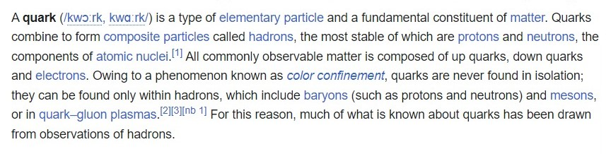
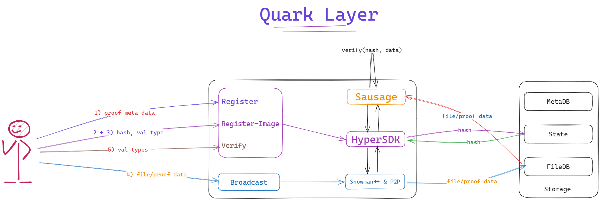
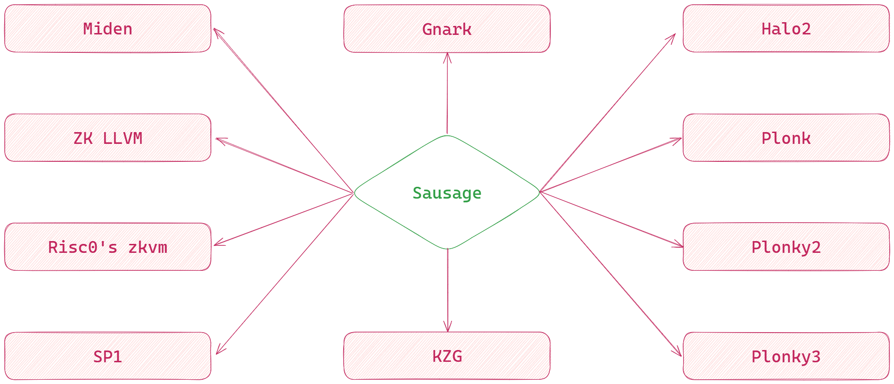

# Quark Layer

- Don't trust blindly, verify cheaply. 
- As fundamental as a Quark.

## What is a Quark?

<p align="center">
 
</p>

## What is Quark Layer?

Quark layer is a zero knowledge proof verification & aggregation layer, built using [hypersdk](https://github.com/ava-labs/hypersdk).

## What verification systems are supported now?

- [Succinctlabs sp1](https://github.com/succinctlabs/sp1)
- [Risczero's zkvm](https://github.com/risc0/risc0)
- [0xpolygonmiden](https://github.com/0xpolygonmiden)
- [Gnark](https://github.com/Consensys/gnark) (under development)

We will be adding support for 
- [ ] [Halo2](https://github.com/zcash/halo2)
- [ ] [Plonky2](https://github.com/0xPolygonZero/plonky2)
- [ ] [Plonky3](https://github.com/Plonky3/Plonky3) 
- [ ] [ZkLLVM](https://github.com/NilFoundation/zkLLVM)
- [ ] [KZG]() 
and ...

## How does Quark Layer work?

##### A simple overview of Quark Layer.

<p align="center">
       
</p>

##### Proving systems and verification systems to be supported by Quark Layer(non-exhasutive)

<p align="center">
    
</p>

## Quick Start(Devnet)

#### Must have:

- Rust and Go lang installed.

#### Recomended tooling:

- It is better to have SP1, RiscZero ZKVM installed in your machine. 

#### Installation:

- Clone all three repos in the same directory:

```shell
git clone https://github.com/sausaging/hypersdk.git
git clone https://github.com/sausaging/hyper-pvzk.git
git clone https://github.com/sausaging/jugalbandi
```
#### Starting Devnet:

- Start rust server(jugalbandi) in 6 different terminals:

```shell
# Terminal 1: Rust Server Hub
cargo run

# Terminal 2: Rust Server instance with rust port 8081 and unint port 8086
PORT=8081 cargo run

# Terminal 3: Rust Server instance with rust port 8082 and unint port 8087
PORT=8082 cargo run

# Terminal 4: Rust Server instance with rust port 8083 and unint port 8088
PORT=8083 cargo run

# Terminal 5: Rust Server instance with rust port 8084 and unint port 8089
PORT=8084 cargo run

# Terminal 6: Rust Server instance with rust port 8085 and unint port 8090
PORT=8085 cargo run
```

- Start hyper-pvzk:

```shell

# Terminal 1:
./scripts/build.sh
./scripts/run.sh

# Terminal 2:
./build/morpheus-cli key import ed25519 demo.pk
./build/morpheus-cli chain import-anr

# Terminal 3:
./build/morpheus-cli chain watch

```

#### Verifing Proofs:
