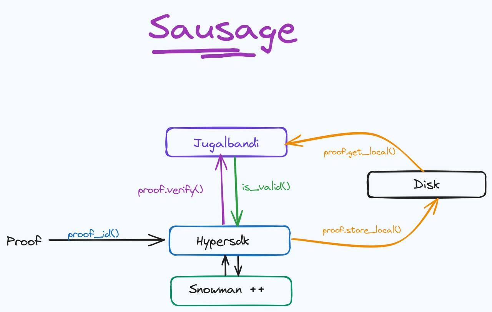
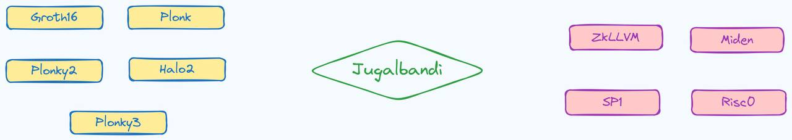
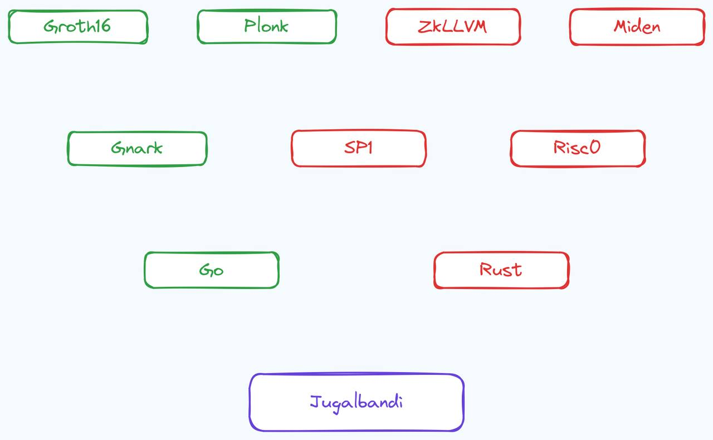

# Quark Layer

- Don't trust blindly, verify cheaply. 
- As fundamental as a Quark.

## What is a Quark?

 

## What is Quark Layer?

Quark layer is a zero knowledge proof verification & aggregation layer, built using [hypersdk](https://github.com/ava-labs/hypersdk).

## What verification systems are supported now?

- [Succinctlabs sp1](https://github.com/succinctlabs/sp1)
- [Risczero's zkvm](https://github.com/risc0/risc0)
- [0xpolygonmiden](https://github.com/0xpolygonmiden)
- [Gnark](https://github.com/Consensys/gnark) (under development)

We will be adding support for 
- [ ] [Halo2](https://github.com/zcash/halo2)
- [ ] [Plonky2](https://github.com/0xPolygonZero/plonky2)
- [ ] [Plonky3](https://github.com/Plonky3/Plonky3) 
- [ ] [ZkLLVM](https://github.com/NilFoundation/zkLLVM)
- [ ] [KZG]() 
and ...

## How does Quark Layer work?

       
    
    

