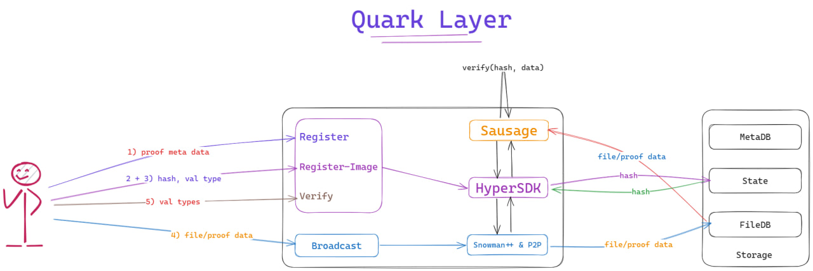

Still a draft.

# Quark Layer

- Don't trust blindly, verify cheaply. 
- As fundamental as a Quark.

## What is a Quark?

Here is what wikipedia has to answer:
<p align="center">
 
</p>

## Why do we need a proof verification and aggregation layer, now?
 
With EIP-4844 in action, data publishing costs for rollups will decrease significantly. Ethereum has a limited gas per block and ethereum is not optimised for all (zero knowledge) verifying systems. Hence proof verification on ethereum is costly. With increasing adoption of Zero-knowledge in web3, the next significant cost would be proof verification cost on the Ethereum.

Aggregated proofs allow to verify multiple proofs as a single proof, instead of verifying them individually. With proof aggregation, multiple proofs can be verified as a single proof on Ethereum, reducing gas costs for proof verification.

Proof generation would require a lot of time and have high hardware requirements. But proof verification will take a few milli seconds. 

## What is Quark Layer?

Quark layer is a fast decentralised Zero Knowledge proof(ZKP) verification & aggregation layer, leveraging [hypersdk](https://github.com/ava-labs/hypersdk), using snowman++ for consensus.

Zero Knowledge proofs are going to stay forever and influence human progress, just like cryptography securing the current internet. ZKPs are going to secure the internet in the next decade or lesser. 

Quark layer is going to support verification of any ZKPs, whether they are releated to web3 or completely general purpose. All the proofs verifyied by Quark layer are posted onto ethereum as an aggregated proof periodically.

## What usecases are unlocked with Quark Layer?

- Cheap and fast verification for Zero knowledge rollups/L2s and Zero knowledge bridges.

- Generic proof verification system to build any zkDapp.

- Interoperability for Zero knowledge rollups.

## What verification systems are supported now?

- [Succinctlabs sp1](https://github.com/succinctlabs/sp1)
- [Risczero's zkvm](https://github.com/risc0/risc0)
- [0xpolygonmiden](https://github.com/0xpolygonmiden)
- [Gnark](https://github.com/Consensys/gnark) (under development)

Support for verifiers to be added:

- [ ] [Halo2](https://github.com/zcash/halo2)
- [ ] [Plonky2](https://github.com/0xPolygonZero/plonky2)
- [ ] [Plonky3](https://github.com/Plonky3/Plonky3) 
- [ ] [ZkLLVM](https://github.com/NilFoundation/zkLLVM)
- [ ] [KZG]() 
and ...

## How does Quark Layer work?


<p align="center">
A simple overview of Quark Layer.
       
</p>


<p align="center">
Verifiers to be supported by Quark Layer(non-exhasutive)
   
</p>

## MVP Quick Start

#### Must have:

- Rust and Go lang installed.

#### Recomended tooling:

- It is good to have SP1, RiscZero ZKVM installed in your machine. 

#### Installation:

- Clone all four repos in the same directory:

```shell
git clone https://github.com/sausaging/hypersdk.git
git clone https://github.com/sausaging/hyper-pvzk.git
git clone https://github.com/sausaging/jugalbandi.git
git clone https://github.com/sausaging/example-proofs.git
```

#### Starting Devnet:

- Start rust server(jugalbandi) in 6 different terminals:

```shell
# Terminal 1: Rust Server Hub
cargo run

# Terminal 2: Rust Server instance with rust port 8081 and unint port 8086
PORT=8081 cargo run

# Terminal 3: Rust Server instance with rust port 8082 and unint port 8087
PORT=8082 cargo run

# Terminal 4: Rust Server instance with rust port 8083 and unint port 8088
PORT=8083 cargo run

# Terminal 5: Rust Server instance with rust port 8084 and unint port 8089
PORT=8084 cargo run

# Terminal 6: Rust Server instance with rust port 8085 and unint port 8090
PORT=8085 cargo run
```

- Start hyper-pvzk:

```shell

# Terminal 1:
./scripts/build.sh
./scripts/run.sh

# Terminal 2:
./build/morpheus-cli key import ed25519 demo.pk
./build/morpheus-cli chain import-anr

# Terminal 3:
./build/morpheus-cli chain watch

```

#### Verifing SP1 Proofs:

i) Register proof related metadata.

```shell
# Run in Terminal 2 of Hyper-pvzk

./build/morpheus-cli testing register
```
- txID obtained is going to be the image id for this proof instance.

ii) Register elf/proof with their hashes to their image id.

- Image ID is the txID obtained in (i).
- Proof val type is 1 for ELF.
- Root hash is the root hash of elf.(feature not yet implemented, so any string works).

```shell
./build/morpheus-cli testing register-image
```

- Do the same for proof with same image id, but proof val type above 1.

iii) Broadcast elf/proof over p2p network.

- File name is path of the elf file. Here it will be `../example-proofs/sp1/riscv32im-succinct-zkvm-elf`
- Chunk index can be anything.(feature not yet implemented)

```shell
./build/morpheus-cli testing broadcast
```

- Do the same for proof, but with file path as `../example-proofs/sp1/proof-with-io.json`

iv) Verify correctness of proofs.

- Verification type is 1 for SP1.
- Time out blocks are the number of blocks in which a validator need to cast their vote.(feature may change)

```shell
./build/morpheus-cli testing verify
```

v) Query if proof is valid or invalid.
```shell
./build/morpheus-cli testing verify-status
```